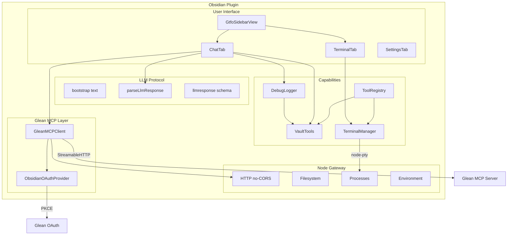

# Architecture

GTFO is an Obsidian plugin built on four pillars: **Glean MCP** for enterprise knowledge, an **embedded terminal** for arbitrary tool execution, **vault tools** for programmatic note management, and an **LLM protocol** layer that turns Glean's chat into a structured, action-aware agent. A **Node Gateway** sits between the UI and all Node.js operations, keeping the browser/Node boundary clean and bypassing CORS.

## Component Diagram



## Data Flow

### Chat message

```
User types, presses Enter
  → ChatTab.sendMessage("chat")
  → Start timing (performance.now)
  → Loading message pushed, typing indicator rendered
  → First message only: prepend bootstrap text
  → GleanMCPClient.chat(message, chatId)
  → NodeGateway.asFetch() (CORS-free)
  → Glean MCP Server
  → Response: { content: [{ type: "text", text: "..." }] }
  → extractRawContent pulls nested llmresponse JSON out of the
    YAML-like serialized chat response
  → parseLlmResponse → { title, body, actions }
  → Loading replaced with assistant message + metrics
    (req_ms, tokens, bytes)
  → Markdown renders, action buttons appear if any
  → If debug mode is on, DebugLogger writes a full dump note
```

### Search (Opt+Enter in chat)

```
User types, presses Opt+Enter
  → ChatTab.sendMessage("search")
  → User message prefixed with 🔍 for visual distinction
  → GleanMCPClient.search(query)
  → parseSearchResults from MCP response
  → Results formatted as llmresponse-shaped Markdown list
    (so the same renderer handles them)
  → Rendered inline in the same chat conversation
  → Metrics shown (req_ms, tokens, bytes)
```

### LLM action execution

```
LLM response includes { actions: [...] }
  → Actions rendered as buttons under the message
  → Execution mode controls behavior:
    - autonomous: execute all actions immediately
    - plan-confirm: user clicks Execute on each (default)
    - step-by-step: same as plan-confirm for now
  → Execute dispatches to:
    - VaultTools.createNote / editNote / moveNote / linkNotes
    - NodeGateway.exec for run_command actions
  → Notice shown for each action result
  → Button marked "Done" after successful execution
```

### OAuth flow

```
User clicks "Connect to Glean"
  → GleanMCPClient.connect() with OAuthProvider + Gateway.asFetch
  → MCP SDK detects 401, starts PKCE flow
  → ObsidianOAuthProvider.redirectToAuthorization() opens browser
  → User authenticates via SSO
  → Glean redirects to obsidian://gtfo/oauth-callback?code=XXX
  → registerObsidianProtocolHandler catches redirect
  → transport.finishAuth() exchanges code for tokens
    (gateway handles URLSearchParams body encoding)
  → Tokens persisted to plugin data
  → connectToGlean() called again with stored tokens
  → listTools() succeeds → "Connected to Glean (N tools)"

Subsequent Obsidian launches:
  → onload() auto-reconnects silently using saved tokens
  → No re-auth needed
```

### Terminal spawn

```
User switches to Terminal tab
  → TerminalTab.initTerminal()
  → xterm.js Terminal + FitAddon created
  → terminal.open(el) in DOM
  → waitForLayout() - poll until element has non-zero dimensions
  → fitAddon.fit() - compute correct cols/rows
  → TerminalManager.spawn(settings, cwd, cols, rows)
    (size passed at spawn — avoids zsh PROMPT_EOL_MARK artifacts)
  → node-pty spawns shell with correct initial size
  → xterm ↔ node-pty bidirectional pipe via TerminalManager
  → ResizeObserver + debounce for future resizes
  → Shell lives on the plugin, not the view —
    tab switches don't kill it
```

## Key Design Decisions

### Node Gateway pattern

All Node.js operations route through `NodeGateway` (`src/gateway/node-gateway.ts`). UI components never import `http`, `fs`, or `child_process` directly. This:

- Keeps the browser/Node boundary explicit
- Bypasses CORS (which blocks browser `fetch` when contacting Glean MCP)
- Handles all `RequestInit.body` types including `URLSearchParams` (required for OAuth token exchange)
- Provides a `fetch`-compatible wrapper for libraries expecting the Fetch API
- Centralizes logging, rate limiting, caching — one place to add cross-cutting concerns

### LLM Protocol

Rather than building a custom agent loop, the plugin uses a **bootstrap text** (system prompt) to teach Glean's LLM a structured JSON response schema:

```json
{ "llmresponse": { "title": "...", "body": "markdown...", "actions": [...] } }
```

Benefits:

- No separate LLM needed — Glean's chat is the brain
- Protocol is human-editable (settings tab)
- LLM proposes vault operations via `actions`
- Degrades gracefully — if JSON parsing fails, the raw text renders

Responses are wrapped in nested YAML by the Glean MCP server, so the parser searches for `"llmresponse"` and extracts the balanced JSON object (handling both escaped and unescaped forms).

### Persistent tab state

Tabs (Chat, Terminal) are created once on view open and their DOM is toggled via `display: none` / `display: flex` on switch. Previously, tabs were destroyed and recreated — which killed chat history and forced the PTY to re-init. Now:

- Chat history survives tab switches
- Terminal scrollback is buffered in `TerminalManager` and replayed to late-attaching views
- `onShow()` hook lets the terminal re-fit after coming out of `display: none`

### Terminal: spawn at correct size

zsh's `PROMPT_EOL_MARK` writes an inverse-video `%` + (cols-1) spaces + `\r \r` to detect missing trailing newlines. If the terminal is spawned at 80 cols but the actual container is 70 cols, the 79 spaces wrap and the `%` gets stranded. Our fix: `fitAddon.fit()` runs **before** `TerminalManager.spawn()`, and the real cols/rows are passed as spawn arguments. zsh then draws its first prompt at the correct width and the clearing sequence works.

Secondary guard: `TerminalManager.resize()` no-ops if the dimensions haven't changed, preventing resize storms from triggering repeated prompt redraws.

### Tool Registry

Every capability is a `ToolDefinition` with `{ name, description, parameters, execute }`. This schema is compatible with OpenAI function calling, Anthropic tool use, and MCP tool schemas. A future agent loop can use `toolRegistry.toFunctionSchemas()` and `toolRegistry.execute(name, args)` to plan and invoke without special-casing each tool.

### Terminal fallback

`node-pty` is a native module that must be compiled against Obsidian's specific Electron version. If it fails to load, the terminal falls back to `child_process.spawn` with an interactive shell. The fallback handles most commands but can't run truly interactive programs like `vim`. Users get a yellow warning banner with the exact load error so they know to run `npm run rebuild-native`.

### Debug mode

When enabled:

- Every Glean chat/search request writes a note with the full raw response, structural analysis, extracted content, parsed llmresponse, and timing.
- Every terminal spawn logs shell + args + cwd + size.
- Every PTY in/out byte is JSON-escaped and appended to a terminal log note (debounced at 250ms to avoid thrashing the vault).

This makes debugging the plugin possible from within Obsidian itself — no DevTools required.
