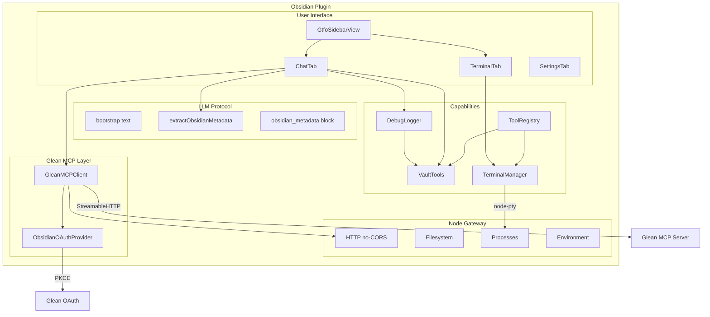

# Architecture

GTFO is an Obsidian plugin built on four pillars: **Glean MCP** for enterprise knowledge, an **embedded terminal** for arbitrary tool execution, **vault tools** for programmatic note management, and an **LLM protocol** layer that turns Glean's chat into a structured, action-aware agent. A **Node Gateway** sits between the UI and all Node.js operations, keeping the browser/Node boundary clean and bypassing CORS.

## Component Diagram



## Data Flow

### Chat message

```
User types, presses Enter
  → ChatTab.sendMessage("chat")
  → Start timing (performance.now)
  → Loading message pushed, typing indicator rendered
  → Build context[] entries: bootstrap (first turn only) + runtime + vault
    listing + open file (if attached) + protocol reminder (follow-up turns)
  → GleanMCPClient.chat({ message: text, chatId, context })
    - text is JUST what the user typed
    - context entries map to the chat tool's native `context: string[]`
      param ("Optional previous messages for context. Will be included
      in order before the current message."), so the model sees them
      slotted in before the user's actual message
  → NodeGateway.asFetch() (CORS-free)
  → Glean MCP Server
  → Response: { content: [{ type: "text", text: "..." }] }
  → extractRawContent → assembleMarkdownFromContent walks the YAML
    blob, finds the messageType: CONTENT block, concatenates every
    text fragment. Result is the LLM's natural-markdown reply.
  → extractObsidianMetadata scans the body for an `obsidian_metadata`
    fenced JSON block and parses it into { title?, tags?, summary?,
    actions? } (or returns {}).
  → stripMetadataBlock removes the fenced block from the body.
  → extractSourcesFromResponse pulls structured + cited documents.
  → Loading replaced with assistant message + metrics, citations,
    and metadata stored on the message.
  → MarkdownRenderer renders the body; tag pills, sources panel,
    and actions panel render below. Save-as-Note uses metadata.title
    + metadata.tags for filename + frontmatter.
  → If debug mode is on, DebugLogger writes a full dump note.
```

### Search (Ctrl+Enter in chat)

```
User types, presses Ctrl+Enter (or Cmd/Opt+Enter)
  → ChatTab.sendMessage("search")
  → User message prefixed with 🔍 for visual distinction
  → GleanMCPClient.search(query)
  → parseSearchResults walks the YAML blob (Glean returns YAML, not
    JSON) and yields one GleanSearchResult per top-level document:
    title, url, datasource, owner (updatedBy.name → owner.name fallback),
    lastUpdated, and the first non-image snippet (HTML stripped).
  → formatSearchResults renders a tight two-line block per result:
    bold linked title with a `·`-separated meta line (datasource ·
    relative time · `by Person`), then the snippet on a hard-broken
    second line. Snippets have leading block-starters (`#`, `-`, `>`)
    stripped so they don't render as headings/lists/quotes.
  → Rendered inline in the same chat conversation
  → Metrics shown (req_ms, N results, bytes — no "tokens")
```

Why we parse YAML: the MCP `search` tool wraps its result in the
standard `{ content: [{ type: "text", text: ... }] }` envelope, but
the inner `text` is a YAML dump (with `documents[N]:`, nested
`similarResults`, image-tagged snippets, etc.) — not JSON. Naive
field lookups would also wrongly attribute nested
`similarResults.visibleResults[*].title` to the parent document, so
matching is anchored at the document's exact indent.

### New chat

```
User clicks "New chat" (toolbar) or runs the
"GTFO: New chat" command
  → ChatTab.newChat()
  → messages = []
  → chatId = undefined
  → Input cleared, placeholder re-rendered
  → Next send re-prepends bootstrap text and
    starts a fresh Glean chat conversation
```

The Glean-side chat isn't explicitly ended — dropping the `chatId` is enough for the next send to start a new conversation server-side.

### Runtime context injection

Every outgoing chat message is paired with a `context[]` array — Glean's chat tool field for "previous messages for context, included in order before the current message". We pack it with system/runtime blocks so the user's actual prompt stays uncluttered:

```
User sends message
  → ChatTab.sendMessage("chat")
  → buildRuntimeContext({ vaultName })
    - today's date, local time, timezone, vault name
  → VaultTools.listVaultEntries({ excludePrefixes: [debugFolder, ...user] })
    - app.vault.getMarkdownFiles() for the file list
    - app.metadataCache.getFileCache(file) for tags + first heading
  → buildVaultListing(entries, { maxChars, vaultName })
    - Tree-grouped, tag-annotated
    - Degrades to folder summary above maxChars
  → VaultTools.readActiveFile()  (when chip is attached)
    - app.workspace.getActiveFile() + vault.read()
  → buildOpenFileContext(file, { maxChars })
    - Path header + fenced markdown body
    - Truncated bodies are flagged so the LLM won't propose a destructive overwrite
  → buildProtocolReminder()  (only on follow-up turns, when chatId is set)
    - Compact imperative re-statement of the obsidian_metadata contract,
      action shapes, and the rule that organize/rewrite requests MUST
      emit actions
  → context = first turn:   [bootstrap, runtime, listing, openFile]
    context = later turns:  [runtime, listing, openFile, reminder]
    (empty entries are filtered out — e.g. open file detached, listing disabled)
  → message = text  (just what the user typed, nothing else)
```

The split between `context` and `message` matters for two reasons:

1. **Glean attends better to a clean message.** When the user's "rewrite this like a pirate" was buried inside 6KB of bootstrap + listing + reminder, the model sometimes treated the runtime block as instructions to follow. Putting it in `context[]` tells Glean these are prior-context entries, not the current ask.
2. **Debug introspection is dramatically easier.** The debug note now renders each context entry as its own collapsible `<details>` block with a one-line summary, instead of a single 6KB JSON-escaped blob. Easy to spot which piece is bloating the request, and easy to copy-paste an individual entry out for inspection.

The protocol reminder exists because Glean's chat agent only sees the verbose bootstrap on turn 1; by turn 3-4 of a multi-turn conversation, the model frequently forgets the `obsidian_metadata` block entirely (returns plain text) or returns `actions: []` for an explicit organize request. The reminder is small (~600 chars) and ships on every follow-up turn as a backstop.

Future work: smarter context pruning. Today every turn ships the full vault listing and (if attached) the full open file body up to the configured caps. Better would be to summarize older turns and dynamically decide which context entries are actually relevant to the current prompt, similar to a retrieval layer.

The `metadataCache` integration is notable — we don't build our own index. Obsidian already parses every note into a fresh `CachedMetadata` record (frontmatter, tags, headings, links, embeds). Reading it is O(1) per file, so rebuilding the listing on every chat turn is essentially free even for vaults with thousands of notes.

### Open-file context + Restore

The chat tab shows a "context chip" above the input with the basename of the markdown file currently active in the workspace. The chip listens to `workspace.on("file-open")` and `workspace.on("active-leaf-change")` so it tracks reality without polling. Clicking the chip flips between `attached` (default — file body ships in the runtime block) and `detached` (chip stays visible but the body is omitted, useful when the user wants to ask about something unrelated to the open note).

When the LLM proposes an `edit_note` / `append_note` / `create_note` / `move_note` action, `executeAction` snapshots the previous state **before** running the operation. On success, the snapshot is wrapped in a `RestoreInfo` whose `apply()` is the inverse:

| Action          | Restore semantics                                              |
| --------------- | -------------------------------------------------------------- |
| `edit_note`     | Write the captured original content back                       |
| `append_note`   | Truncate back to the captured pre-append content               |
| `create_note`   | Delete the new file (or restore the file it overwrote)         |
| `move_note`     | Move the file from `targetPath` back to `path`                 |

The Restore button is appended to the action row alongside "Done" so the user can revert the last change without re-prompting the model. Action rows live for the lifetime of the assistant message, so multiple turns each have their own Restore history.

`insert_at_cursor`, `link_notes`, and `run_command` deliberately don't get restore — undoing them safely requires tracking ranges or arbitrary side effects that aren't worth the complexity.

### LLM action execution

```
LLM response includes { actions: [...] }
  → Actions rendered as buttons under the message
  → Execution mode controls behavior:
    - autonomous: execute all actions immediately
    - plan-confirm: user clicks Execute on each (default)
    - step-by-step: same as plan-confirm for now
  → Execute dispatches to:
    - VaultTools.createNote / editNote / moveNote / linkNotes
    - NodeGateway.exec for run_command actions
  → Notice shown for each action result
  → Button marked "Done" after successful execution
```

### OAuth flow

```
User clicks "Connect to Glean"
  → GleanMCPClient.connect() with OAuthProvider + Gateway.asFetch
  → MCP SDK detects 401, starts PKCE flow
  → ObsidianOAuthProvider.redirectToAuthorization() opens browser
  → User authenticates via SSO
  → Glean redirects to obsidian://gtfo/oauth-callback?code=XXX
  → registerObsidianProtocolHandler catches redirect
  → transport.finishAuth() exchanges code for tokens
    (gateway handles URLSearchParams body encoding)
  → Tokens persisted to plugin data
  → connectToGlean() called again with stored tokens
  → listTools() succeeds → "Connected to Glean (N tools)"

Subsequent Obsidian launches:
  → onload() auto-reconnects silently using saved tokens
  → No re-auth needed
```

### Terminal spawn

```
User switches to Terminal tab
  → TerminalTab.initTerminal()
  → xterm.js Terminal + FitAddon created
  → terminal.open(el) in DOM
  → waitForLayout() - poll until element has non-zero dimensions
  → fitAddon.fit() - compute correct cols/rows
  → TerminalManager.spawn(settings, cwd, cols, rows)
    (size passed at spawn — avoids zsh PROMPT_EOL_MARK artifacts)
  → node-pty spawns shell with correct initial size
  → xterm ↔ node-pty bidirectional pipe via TerminalManager
  → ResizeObserver + debounce for future resizes
  → Shell lives on the plugin, not the view —
    tab switches don't kill it
```

## Key Design Decisions

### Node Gateway pattern

All Node.js operations route through `NodeGateway` (`src/gateway/node-gateway.ts`). UI components never import `http`, `fs`, or `child_process` directly. This:

- Keeps the browser/Node boundary explicit
- Bypasses CORS (which blocks browser `fetch` when contacting Glean MCP)
- Handles all `RequestInit.body` types including `URLSearchParams` (required for OAuth token exchange)
- Provides a `fetch`-compatible wrapper for libraries expecting the Fetch API
- Centralizes logging, rate limiting, caching — one place to add cross-cutting concerns

### LLM Protocol

Rather than building a custom agent loop, the plugin uses a **bootstrap text** (system prompt) to teach Glean's LLM a tiny convention: respond in natural Markdown, and append one fenced `obsidian_metadata` JSON block at the end of every reply with optional `title`, `tags`, `summary`, and `actions`.

```markdown
Here's the summary you asked for…

```obsidian_metadata
{
  "title": "Glean Org Chart Quick Start",
  "tags": ["org-chart", "glean", "people"],
  "summary": "How to find your team in Glean's Directory.",
  "actions": []
}
```
```

Benefits:

- No separate LLM needed — Glean's chat is the brain
- Protocol is human-editable (settings tab)
- LLM responds in natural markdown — no JSON envelope to fight Glean's response shape, citation positioning is preserved, fragmented streaming works
- Title and tags arrive **with** the response, so Save-as-Note doesn't need a follow-up LLM call to figure out what to call the note
- The `obsidian_metadata` block is small, easy to find with a regex, and gets stripped from the body before render so the user never sees the raw JSON

The previous design wrapped every response in `{"llmresponse": {"title", "body", "actions"}}`. Glean's agent splits text fragments around inline citations, which made the JSON unparseable across multi-fragment responses and erased the citation boundaries. The new minimal contract avoids both problems and adds richer side-info (tags, summary) without bloating the response.

### Persistent tab state

Tabs (Chat, Terminal) are created once on view open and their DOM is toggled via `display: none` / `display: flex` on switch. Previously, tabs were destroyed and recreated — which killed chat history and forced the PTY to re-init. Now:

- Chat history survives tab switches
- Terminal scrollback is buffered in `TerminalManager` and replayed to late-attaching views
- `onShow()` hook lets the terminal re-fit after coming out of `display: none`

### Terminal: spawn at correct size

zsh's `PROMPT_EOL_MARK` writes an inverse-video `%` + (cols-1) spaces + `\r \r` to detect missing trailing newlines. If the terminal is spawned at 80 cols but the actual container is 70 cols, the 79 spaces wrap and the `%` gets stranded. Our fix: `fitAddon.fit()` runs **before** `TerminalManager.spawn()`, and the real cols/rows are passed as spawn arguments. zsh then draws its first prompt at the correct width and the clearing sequence works.

Secondary guard: `TerminalManager.resize()` no-ops if the dimensions haven't changed, preventing resize storms from triggering repeated prompt redraws.

### Tool Registry

Every capability is a `ToolDefinition` with `{ name, description, parameters, execute }`. This schema is compatible with OpenAI function calling, Anthropic tool use, and MCP tool schemas. A future agent loop can use `toolRegistry.toFunctionSchemas()` and `toolRegistry.execute(name, args)` to plan and invoke without special-casing each tool.

### Tools settings panel

MCP tools discovered via `tools/list` are surfaced under Settings → Tools as a single summary row with three actions:

- **Refresh**: re-query the server and update `discoveredTools`.
- **Manage**: open `ToolManagementModal` — a focused dialog with one card per tool (enable/disable toggle + JSON-Schema parameters table from `tool.inputSchema.properties`, marking `required` fields and surfacing `enum` / `default` when present). The card list scrolls inside the modal, so the settings tab never grows unbounded as more tools come online.
- **View raw**: open `RawToolsListModal` — a dump of the unprojected `tools/list` payload (cached on `GleanMCPClient.lastListToolsRaw`). Useful for inspecting fields we don't surface in `DiscoveredTool` — annotations, output schemas, `_meta` — and for sharing the payload with someone debugging a misbehaving server.

Toggling a card persists to `disabledTools: string[]` in settings. `GleanMCPClient.isToolDisabled` is a plugin-provided predicate consulted inside `callTool` — disabled tools throw before any network traffic, so the gate is effective for any caller (chat, search, future agent loops).

### Terminal fallback

`node-pty` is a native module that must be compiled against Obsidian's specific Electron version. If it fails to load, the terminal falls back to `child_process.spawn` with an interactive shell. The fallback handles most commands but can't run truly interactive programs like `vim`. Users get a yellow warning banner with the exact load error so they know to run `npm run rebuild-native`.

### Debug mode

When enabled:

- Every Glean chat/search request writes a note with the full raw response, structural analysis, extracted markdown content, parsed `obsidian_actions`, and timing.
- Every terminal spawn logs shell + args + cwd + size.
- Every PTY in/out byte is JSON-escaped and appended to a terminal log note (debounced at 250ms to avoid thrashing the vault).

This makes debugging the plugin possible from within Obsidian itself — no DevTools required.
