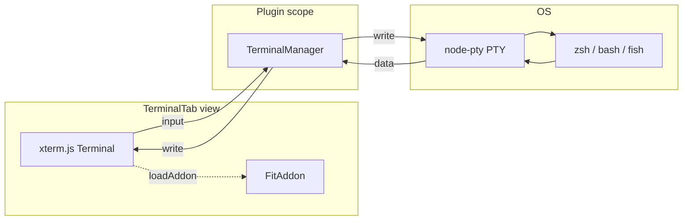

# Terminal

GTFO's terminal is a real PTY running inside Obsidian, using [xterm.js](https://xtermjs.org/) for rendering and [node-pty](https://github.com/microsoft/node-pty) for the PTY layer. Same stack as VS Code's integrated terminal.

## Capabilities

- Interactive programs work: `vim`, `htop`, `claude` CLI, `less`, etc.
- Full ANSI color support including 24-bit / truecolor
- Tab completion, arrow-key history, readline editing
- Resize handling (PTY size follows the panel)
- Scrollback buffer (10,000 lines by default)
- Runs in your vault directory so relative paths and git just work

## Architecture



Key boundary: **the PTY lives on the plugin**, not the view. Switching away from the Terminal tab or closing the sidebar doesn't kill your shell. The view destroys and re-creates the xterm instance, but the `TerminalManager` keeps the PTY alive and replays its scrollback buffer when a new view attaches.

## Lifecycle

### Spawn

The spawn sequence matters because zsh (and other shells) render their prompt based on the terminal size they see at startup:

```
1. TerminalTab.render() creates xterm container div
2. Initialize xterm.js Terminal + FitAddon
3. terminal.open(el)
4. waitForLayout(el) — requestAnimationFrame loop until
   el.clientWidth > 0 && el.clientHeight > 0
5. fitAddon.fit() — compute correct cols/rows
6. TerminalManager.spawn(settings, cwd, cols, rows)
   ← Shell is spawned with the correct size from the start
7. Wire up data flow (xterm onData ↔ PTY write, PTY onData ↔ xterm write)
8. terminal.focus()
```

This ordering is essential. The previous code spawned at a default 80x24, then resized. zsh's `PROMPT_EOL_MARK` logic (inverse-video `%` + cols-1 spaces + `\r \r` clear) then ran at the wrong width, and when we resized the prompt got stuck, leaving stranded `%` or other artifacts. Size-at-spawn eliminates the race.

### Resize

A `ResizeObserver` watches the terminal container. On resize:

1. Debounced 100ms to avoid thrashing during animated layout changes
2. `fitAddon.fit()` recomputes cols/rows
3. xterm emits an `onResize` event
4. `TerminalManager.resize(cols, rows)` forwards to PTY
5. If `cols === lastCols && rows === lastRows`, it no-ops — the shell isn't bothered unless something actually changed

### Tab switch

Tab panels are hidden with `display: none` rather than destroyed. When the terminal tab becomes visible again:

1. `onShow()` is called on the `TerminalTab` instance
2. `fitAddon.fit()` runs (dimensions are valid again)
3. `terminal.focus()`

No PTY reinit, no scrollback loss, no size race.

### Kill / New / Clear

- **New** — kills the current shell and spawns a fresh one at the current dimensions
- **Kill** — SIGTERM to the shell; leaves the terminal display alone
- **Clear** — clears the xterm screen AND the scrollback buffer on the manager

### Scrollback buffer

`TerminalManager` buffers every byte the PTY emits in a rolling ~200KB buffer. When a view subscribes to `onData`, the entire buffer replays synchronously. This means:

- Tab switch away and back — you see the full history
- Obsidian sidebar collapse/expand — history preserved
- The PTY keeps writing even when no view is subscribed

## Shell Configuration

Configurable in Settings → Terminal:

| Setting | Default | Description |
|---------|---------|-------------|
| Shell | `$SHELL` or `/bin/zsh` | Absolute path to the shell binary |
| Shell args | _(empty)_ | Space-separated args. Supports quoted strings. |
| Font size | 13 | Terminal font size in pixels |

### Useful shell args

| Args | Effect |
|------|--------|
| `-l` | Login shell. Loads `.zprofile` / `.zlogin`. Good for getting your full PATH. |
| `-f` | Skip `.zshrc`. Useful when something in your rc file emits escape sequences the terminal can't parse. |
| `-i` | Interactive (default for most shells) |

If you're seeing weird artifacts in the terminal (stranded `%`, `]`, or similar), set Shell args to `-f`. If that makes them go away, your rc file is the cause — likely a conda hook, p10k prompt, iTerm2 shell integration, or VSCode shell integration emitting sequences xterm.js doesn't handle.

### Environment

The shell is spawned with:

```
TERM=xterm-256color
COLORTERM=truecolor
LANG=en_US.UTF-8 (or your current LANG)
LC_ALL=en_US.UTF-8 (or your current LC_ALL)
GTFO_TERMINAL=1
```

`GTFO_TERMINAL=1` lets your shell init scripts detect this environment and skip incompatible integrations:

```zsh
# In ~/.zshrc
[[ -n "$GTFO_TERMINAL" ]] && {
  # skip iTerm2 integration, p10k instant prompt, etc.
  unsetopt PROMPT_CR PROMPT_SP
}
```

## node-pty

`node-pty` is a native module — it must be compiled against Obsidian's Electron version. Pre-built binaries won't work because Obsidian ships a specific Electron that may not match any standard ABI.

### Building

```bash
npm run rebuild-native
```

`scripts/rebuild-native.sh` auto-detects the Electron version by inspecting `/Applications/Obsidian.app` and runs `@electron/rebuild` for `node-pty`. Run this once after install, and again after Obsidian updates if the terminal breaks.

### Loading

Because Obsidian patches the plugin's `require` function, loading `node-pty` by bare name doesn't always work. `TerminalManager.tryLoadNodePty()` tries multiple strategies:

1. Absolute path: `<plugin-dir>/node_modules/node-pty`
2. `createRequire(<plugin-dir>/main.js)("node-pty")`
3. Bare `require("node-pty")`

The first successful one wins. If all fail, the terminal falls back to `child_process.spawn` with an interactive shell. You'll see a yellow warning banner with the exact load error so you know to run `npm run rebuild-native`.

## Debug Logging

When debug mode is on, the terminal manager writes every operation to a debug note in real time:

- Spawn: shell, args, cwd, size, transport
- Every PTY `in:` / `out:` in JSON-escaped form (so you see escape sequences literally)
- Resize events
- Exit code

See [Debug](debug.md) for the full debug mode documentation.

## Limitations

- **One session at a time.** Multi-session is on the roadmap.
- **No shell integration yet.** OSC 133 prompt marks and CWD tracking aren't wired up, so "go to prompt" and "insert vault path" features don't exist yet.
- **Copy/paste uses xterm's default bindings.** `Cmd+C` copies selection, `Cmd+V` pastes. Bracketed paste mode (`\x1b[?2004h`) is supported.
- **No GPU acceleration.** xterm.js's WebGL renderer isn't enabled. Performance is fine for normal use but may struggle with heavy output (try `yes | head -c 100M`).
